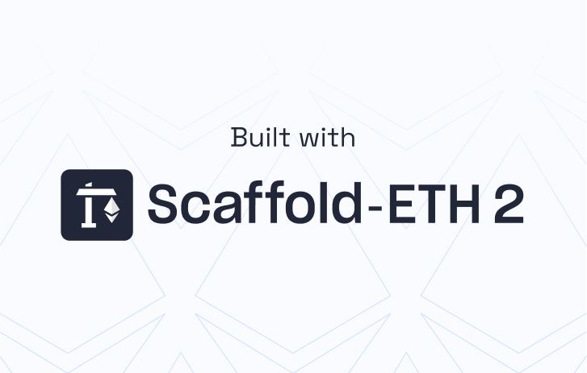

# 🌟 Blockchain Crowdfunding dApp

A decentralized crowdfunding platform built with Next.js, React, and Alchemy's Account Kit that allows users to create and support campaigns using cryptocurrency. This project showcases modern web3 development techniques and best practices.



## ✨ Features

- **Create Campaigns**: Launch your own crowdfunding campaigns with customizable details, funding goals, and deadlines
- **Smart Wallet Integration**: Seamless authentication using Alchemy's Account Kit
- **Donate to Projects**: Support campaigns you believe in with ETH
- **Claim Funds**: Campaign owners can claim collected funds once the campaign reaches its target
- **Real-time Updates**: Track funding progress and campaign status in real-time
- **Responsive Design**: Optimized for all devices from mobile to desktop

## 🛠️ Technologies Used

- **Frontend**: React, Next.js, TailwindCSS
- **Blockchain Integration**: Alchemy SDK, Viem
- **Authentication**: Alchemy's Account Kit with Smart Wallets
- **Smart Contracts**: Solidity, Hardhat
- **Development Environment**: TypeScript, Scaffold-Alchemy

## 🚀 Getting Started

### Prerequisites

Before you begin, you need to install the following tools:

- [Node.js (>= v22.0)](https://nodejs.org/en/download/)
- [Yarn](https://yarnpkg.com/getting-started/install)
- [Git](https://git-scm.com/downloads)

### Installation

1. Clone the repository

```bash
git clone https://github.com/yourusername/blockchain-crowdfunding-dapp.git
cd blockchain-crowdfunding-dapp
```

2. Install dependencies

```bash
yarn install
```

3. Create a `.env.local` file in the `packages/nextjs` directory with the following variables:

```
NEXT_PUBLIC_ALCHEMY_API_KEY=your_alchemy_api_key
NEXT_PUBLIC_WALLET_CONNECT_PROJECT_ID=your_walletconnect_project_id
NEXT_PUBLIC_GAS_POLICY_ID=your_gas_policy_id
```

4. Deploy the smart contracts to a testnet

```bash
yarn deploy
```

5. Start the development server

```bash
yarn start
```

6. Open [http://localhost:3000](http://localhost:3000) in your browser

## 📖 How It Works

1. **Connect Your Wallet**: Use the "Login" button to connect with Alchemy's Smart Wallet
2. **Browse Campaigns**: View active crowdfunding campaigns on the home page
3. **Create a Campaign**: Use the form to create your own campaign with a title, description, target amount, and deadline
4. **Donate**: Support campaigns by donating ETH
5. **Claim Funds**: If you're a campaign owner and the funding goal is reached, claim your funds

## 🧪 Testing

Run the test suite with:

```bash
yarn test
```

## 📝 Project Structure

- `/packages/hardhat/`: Smart contracts and deployment scripts
- `/packages/nextjs/`: Next.js frontend application
  - `/components/`: React components including campaign cards and forms
  - `/hooks/`: Custom React hooks for blockchain interactions
  - `/pages/`: Application pages and routing

## 📄 License

This project is licensed under the MIT License - see the LICENSE file for details.

## 🙏 Acknowledgements

- [Scaffold-Alchemy](https://github.com/alchemyplatform/scaffold-alchemy) for the initial project structure
- [Alchemy](https://www.alchemy.com/) for their powerful blockchain APIs and Account Kit
- [Next.js](https://nextjs.org/) for the React framework
- [Hardhat](https://hardhat.org/) for the Ethereum development environment
